## Understanding different GC modes with Concurrency Visualizer

In this post I’m going to visualize what exactly happens during Garbage Collection (GC) and how different GC modes can significantly affect application performance.

I assume that the reader is familiar with garbage collection basics. If this isn’t the case I encourage you to spend 15 minutes to fill this gap, for instance from the following article – “Fundamentals of Garbage Collection” or from a chapter in your favorite book on C#/.NET (*).

The Garbage Collector in the CLR is a very complicated, configurable and self-tuning creature that may change behavior based on application needs. To satisfy different memory usage requirements the GC has some options to configure how it operates. There are two main modes: Workstation mode (designed to minimize delays) and Server mode (designed for maximum application throughput). The GC also supports one of two “sub-modes” - concurrent or non-concurrent (**).
Workstation GC vs. Server GC
Workstation GC is designed for desktop applications to minimize the time spent in GC. In this case GC will happen more frequently but with shorter pauses in application threads. Server GC is optimized for application throughput in favor of longer GC pauses. Memory consumption will be higher, but application can process greater volume of data without triggering garbage collection.

All managed objects are stored in segments. There is one segment for young generations (called the ephemeral segment) and many segments for generation 2 and large object heap. When the ephemeral segment is full, CLR will allocate a new one. But before that, GC will happen. The size of the segment varies depending on whether a system is 32- or 64-bit, and on the type of the garbage collector. Workstation GC uses smaller segments and Server GC uses bigger segment, although the size depends on the number of CPU cores. Smaller the segments are more frequently GC will occur. Workstation GC is used by default in all managed apps and is best suited for UI applications. Server GC could be turned on by the CLR host or configured in <gcServer> element in the application configuration file and intended for server applications.

GC flavors like ‘concurrent’ or ‘non-concurrent’ may help fine tune the garbage collection to gain maximum performance and/or responsiveness for your application. Concurrent mode reduces the overall time spent in GC because the mark phase for 2nd generation happens in dedicated thread in parallel with application threads. In this mode, GC suspends user threads for shorter amount of time but will use slightly more memory.

Concurrent Workstation GC is best suited for UI applications and non-concurrent Workstation GC should be used for lightweight server processes or for server apps on single-core machines.

To visualize the GC, I’ll be using a tool called Concurrency Visualizer, observing a simple console application. Concurrency Visualizer is a Visual Studio extension that shows various threading aspects of the application, like lock contention, thread synchronization, input-output operations, GC pauses and other. The app is simply allocates byte arrays. Some arrays are kept in the internal lists and some of them are eligible for garbage collection immediately.

Now, let’s take a look at each mode in more details using Concurrency Visualizer.
Workstation GC: non-concurrent mode
There are a few reasons for GC to happen: Generation 0 is full or Gen0 budget is reached, GC.Collect was called, or the system memory is low. We are only interested in the first option.

Here is a very rough algorithm for workstation non-concurrent GC:

Application thread allocates an object and GC can’t fulfill the request. GC is started.
CLR suspends all managed threads.
CLR collects the garbage in the thread that triggered the GC.
CLR resumes all application threads once GC is done.
For testing purposes, I’m using a laptop with a Core i7 processor. The sample application is using 8 threads to do its job, but I will show fewer threads for the sake of simplicity.

Steps #1 and 2: CLR suspends all managed threads:

Above, we see GC was triggered by thread 2948 and it waits for the CLR to suspend all managed threads. After that, the thread will collect the garbage and (as we will see in a moment) compact the heap. Note, heap compaction isn’t happening for every GC. The CLR tries to maximize GC performance and compacts the heap only when garbage/survivor ratio is high and compaction is useful.

Step #3: garbage collection:

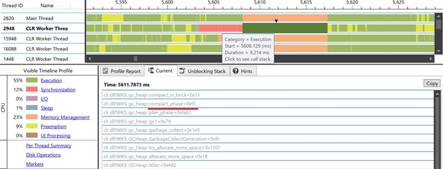

While GC is in progress, all managed threads are suspended waiting for GC:

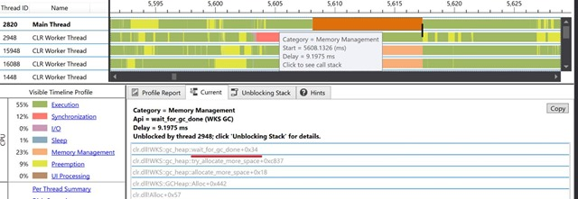

This example shows GC for Gen0, but in non-concurrent workstation GC, the process is the same for older generations as well. It just takes more time.

Now let’s look at more sophisticated mode: concurrent Workstation GC.
Workstation GC: concurrent mode
In concurrent (or background) mode, the CLR creates a dedicated high-priority thread for Gen2 collection. In this case, the first phase of the garbage collection, mark phase, is happening in parallel with application threads. During this phase the application is still running, so user threads can allocate new objects and even trigger GC for young generations.

This is the main difference between old Concurrent GC available in pre .NET 4.0 era and the new Background GC. Concurrent GC also had a dedicated worker thread for Gen2 collection, but unlike Background GC if a user thread triggered GC, the thread was blocked while current GC is in progress. Background GC allows ephemeral collection in the middle of the background one. Background GC supersedes Concurrent GC and the same key is used to turn it on. In .NET 4.0+ there is no way to use Concurrent GC any more.

Here is how GC looks like for background Workstation GC:

Application thread allocates an object and GC can’t fulfill the request. GC is started.
CLR suspends all managed threads.
CLR collects Gen0 and Gen1.
CLR starts background collection and resumes all managed threads.
Background thread marks all reachable objects in memory and suspends application threads for sweep or compact phase.
CLR resumes all application threads once GC is done.
This is a very basic description and set of steps could differ based on some heuristics, like the degree of heap fragmentation or if there are any GC requests during background collection.

In the following case GC was triggered by thread 12600, and the thread waits till all the threads are suspended:

Then the thread 12600 collects Gen0 and Gen1:

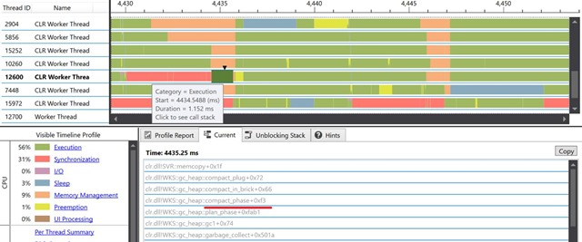

Then GC starts background collection for Gen2:

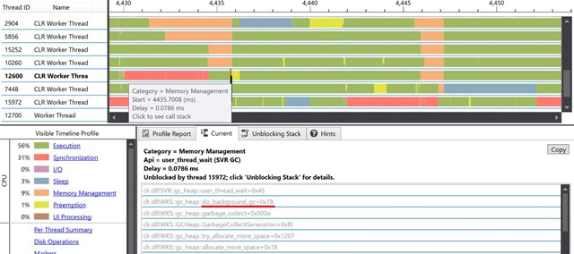

And thread 15972 starts background collection:

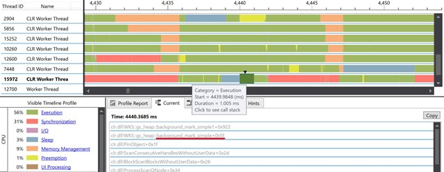

After the mark phase, the background thread suspends the worker threads until GC is done:

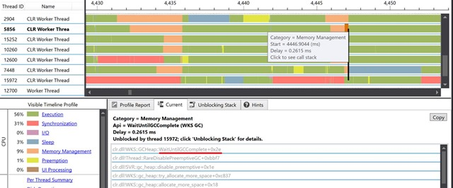

The background thread sweeps the heap:

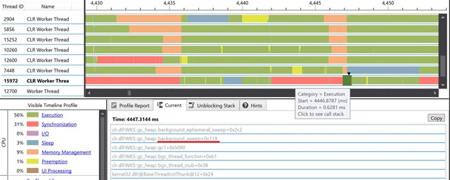

And releases free segments while application threads are running:

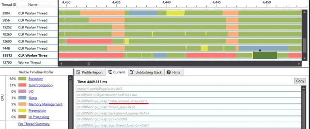

Server GC has a few very important aspects that affect garbage collection:

*  Server GC is using bigger segments (few times bigger than for workstation GC).

* The CLR creates 1 managed heap per core. This means that for an 8 core machine, the CLR will allocate 8 distinct managed heaps.

* GC happens in dedicated threads: one thread per managed heap.

Server GC trades memory in favor of throughput. Larger heaps mean that memory saturation happens less frequently, but once it happens, the CLR needs to do more work to traverse the heap. As a result, the application consumes more memory and GC will happen less frequently, but every GC will take longer period of time even for collecting Gen0 and Gen1.

To speed up the GC CLR is uses a dedicated high priority thread even for ephemeral collection. In the case of background GC the CLR will create yet another set of threads (one per core) for background analysis. Managed applications with background server GC will use 16 additional threads for an 8 core machine!

Now let’s take a look at Server GC with Background mode. (Note: Background Server GC is available only from .NET Framework 4.5). Because the number of threads is so high I’ll show only a part of them.

The basic workflow for Background Server GC is as following:

Application thread allocates an object and GC can’t fulfill the request. GC is started.
CLR suspends all managed threads.
CLR collects Gen0 and Gen1 in dedicated GC worker threads.
CLR suspends GC worker threads and starts background collection. All the managed threads are resumed.
Background threads mark all reachable objects in memory and suspend application threads for sweep or compact phase.
CLR resumes GC worker threads to sweep the heap.
Application threads wait for GC to finish.
The following screenshots shows the 3 groups of threads:

* First 4 threads are foreground GC threads responsible for collecting its own heap.

* Second 4 threads are application worker threads.

* Last 4 threads are dedicated for background GC.

The screenshot below shows that application threads are suspended waiting for foreground GC to finish:

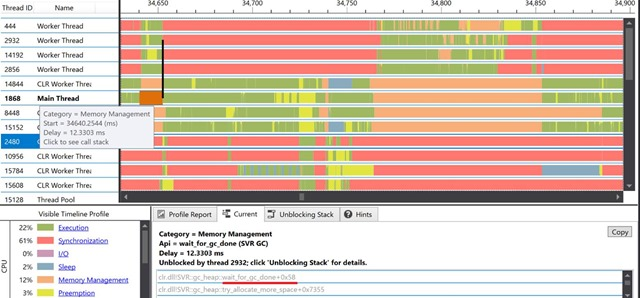

GC Worker threads are doing Gen0/Gen1 collection:

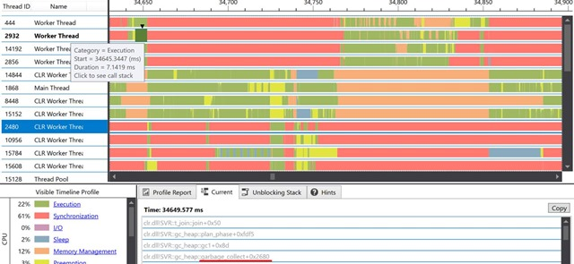

GC triggers a background collection:

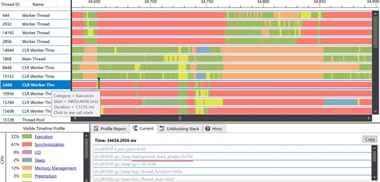

Then the CLR resumes GC worker threads to compact the heap:
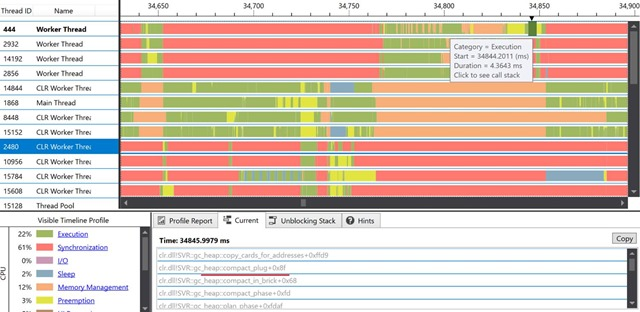

Meanwhile application threads are blocked waiting for GC to finish:

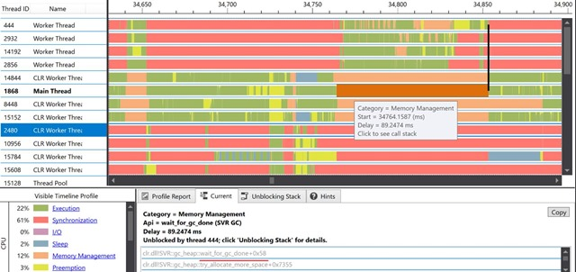

As you can see, background Server GC is more complicated that the workstation GC. It requires more resources and more complicated cross-thread collaboration.
Server GC vs. Workstation GC in a real application
GC has significant effect on any performance critical managed application. Allocations are very cheap, but garbage collection is not. Different GC modes are more suitable for different kinds of apps; and a basic understanding of how GC works can help you pick the right mode. Just switching from one GC mode to another could increase end-to-end application performance significantly.

In my spare time I work on a Roslyn analyzer project called ErrorProne.NET. The tool helps find some common errors in C# programs like invalid format strings or suspicious/invalid exception handling. Like every analyzer, ErrorProne.NET could be integrated in Visual Studio but in some cases console mode (CLI, Command Line Interface) is more preferable.

To validate newly created rules and to check performance, I’m constantly running ErrorProne.NET on different open-source projects, like StylecopAnalyzers or the Roslyn codebase itself. To do that I’m using a console application that opens the solution, runs all the analyzers and prints a report in a human readable form.

By default every console application uses Background Workstation GC and recently I’ve decided to check what will happen if I’ll switch to Server GC. Here is what I’ve got by running my app with different GC modes and ‘Prefer 32bit’ flag enabled. I’ve used PerfView to collect this information:

|GC Mode|E2E time (ms)|Total GC Pause (ms)|% Time paused for GC|Gen0 Count|Gen1 Count|Gen2 Count|Total Allocations (Mb)|Max GC Heap Size (Mb)|
|---|---|---|---|---|---|---|---|---|
|Workstation GC|132 765|46 118|35.1%|1674|1439|35|174 691|1 561|
|Background Workstation GC|132 008|39 798|30.4%|2109|1451|65|225 554|1 676|
|Server GC|102 553|9 026|9.1%|28|130|8|17 959|1 667|
|Background Server GC|99 867|8 040|8.5%|23|148|9|16 610|1 724|
 

This table clearly shows the huge difference between Server GC and Workstation GC for this application: just by switching from default Workstation GC to Server GC End-to-End time dropped by 30%! There are two reasons for this: number of managed heaps and segment size. Bigger segments allow allocating more objects in ephemeral segment and drastically reduces number of Gen0 and Gen1 collections: from 3500 to 200. Lower number of garbage collections significantly reduced the total allocations size (from 170Gb to 17Gb).

Another interesting data point is the number of GC pauses that took longer than 200ms and mean GC duration for different workstation GC flavors:

|GC Mode|Number of GC pause > 200ms|Gen0 (ms)|Gen1 (ms)|Gen2 (ms)|All (ms)|
|---|---|---|---|---|---|
|Workstation GC|11|6.8|16.2|322.6|14.7|
|Background Workstation GC|2|7.9|15.4|12.7|11.0|
 

The table shows that Background mode reasonably reduces amount of long GC pauses by reducing Gen2 collection time.
Conclusion
Not everyone is working on high performance managed applications. In many cases GC can efficiently do its job without any human intervention. Application performance is unaffected and the main concern of the developer lies elsewhere.

But this isn’t always the case.

Many of us are working on system-level or high performance software written in C# like games, database servers or web-servers with huge load. In this case, good understanding of what GC does is crucial. It is very important to understand the behavior for different GC modes, what a memory segment is, and why a GC pause in one case could be way higher than in another.

I hope this post helped you to build a mental model in your head for the various GC modes and gave enough information to take GC seriously.
Additional resources